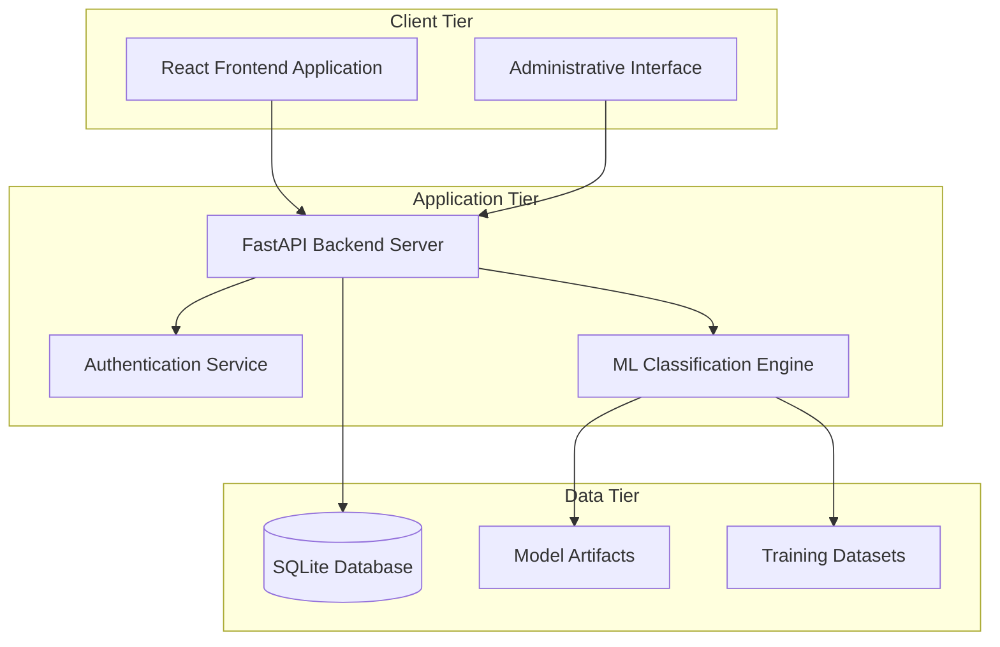
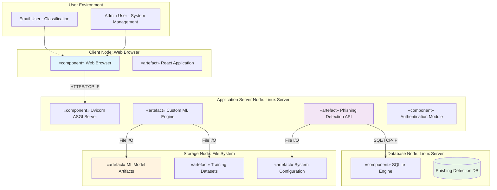
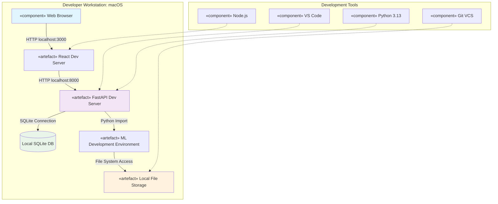
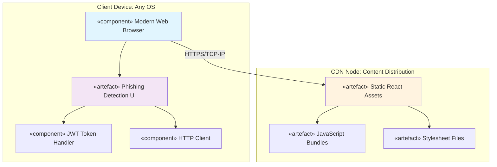
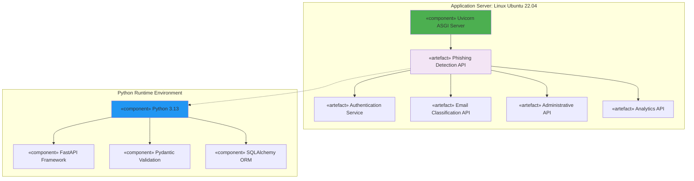
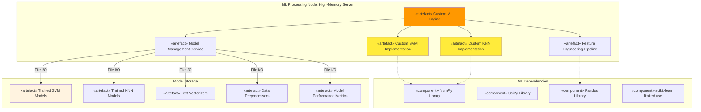
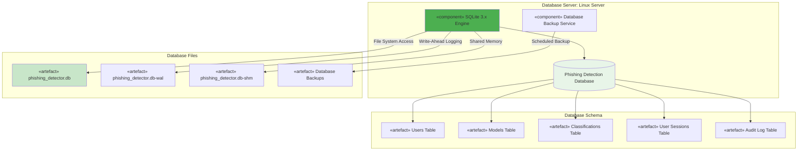
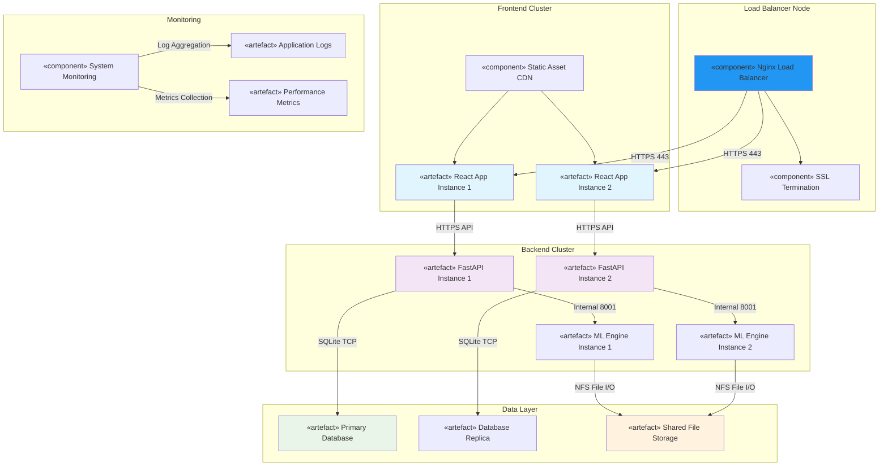

# Advanced Phishing Email Detection System
## Deployment Architecture & Resource Breakdown

**Student:** Xolani Kula  
**Date:** October 16, 2025  
**Project:** Advanced Phishing Email Detection Using Custom Machine Learning Algorithms

---

## Table of Contents

1. [System Overview](#system-overview)
2. [Deployment Architecture](#deployment-architecture)
3. [Component Deployment Diagrams](#component-deployment-diagrams)
4. [Resource Breakdown](#resource-breakdown)
5. [Deployment Specifications](#deployment-specifications)
6. [Infrastructure Requirements](#infrastructure-requirements)

---

## 1. System Overview

The Advanced Phishing Email Detection System is a multi-tier application consisting of:

- **Backend API Server** (FastAPI-based Python application)
- **Frontend Web Application** (React-based user interface)
- **Machine Learning Engine** (Custom SVM and KNN implementations)
- **Database Layer** (SQLite for development, scalable to PostgreSQL)
- **Data Storage** (Model artifacts, datasets, and preprocessing components)

### System Architecture Components

---

## 2. Deployment Architecture

### Production Deployment Overview

### Development Deployment

---

## 3. Component Deployment Diagrams

### 3.1 Frontend Deployment

### 3.2 Backend API Deployment

### 3.3 Machine Learning Engine Deployment

### 3.4 Database Deployment

### 3.5 Complete System Deployment

---

## 4. Resource Breakdown

**Note:** This is an honours research project conducted using existing university resources and open-source software. The resource breakdown below represents theoretical costs and resource requirements for educational purposes, not actual project expenditure.

### 4.1 Human Resources (Academic Research Context)

| Role | Responsibilities | Academic Context |
|------|------------------|------------------|
| **Student Researcher** | System architecture, ML implementation, documentation | Honours thesis requirement |
| **UI Development** | React frontend development, user experience design | Part of full-stack implementation |
| **System Integration** | Deployment setup, testing, monitoring configuration | DevOps learning component |
| **Testing & Validation** | Integration testing, performance testing, security testing | Quality assurance requirement |
| **Documentation** | Technical documentation, user guides, academic writing | Thesis documentation |
| **Research Supervision** | Academic guidance, milestone reviews, feedback sessions | Supervisor consultation |

**Total Research Effort: February to October 2025 (Honours Research Project)**

### 4.2 Hardware Resources (University/Personal Equipment)

#### Development Environment (Existing Resources)
| Component | Specification | Usage | Academic Access |
|-----------|--------------|-------|-----------------|
| **Development Workstation** | MacBook Pro M2, 16GB RAM, 512GB SSD | Personal laptop | Student-owned |

**Actual Hardware Investment: R20,000 (MacBook Pro only)**

### 4.3 Software Resources (Open Source & Educational)

#### Development Tools (Free/Educational Licenses)
| Software | License Type | Usage | Cost |
|----------|-------------|-------|------|
| **VS Code** | Free/Open Source | Primary IDE | $0 |
| **Python 3.13** | Free/Open Source | Runtime environment | $0 |
| **Node.js** | Free/Open Source | Frontend development | $0 |
| **Git/GitHub** | Free (Educational) | Version control | $0 |
| **SQLite** | Free/Open Source | Database system | $0 |
| **Mermaid** | Free/Open Source | Diagram generation | $0 |

**Total Software Cost: $0 (All open source/educational)**

### 4.4 Data and Training Resources (Academic Research)

| Resource | Description | Size/Quantity | Academic Context |
|----------|-------------|---------------|------------------|
| **CEAS-08 Dataset** | Public research dataset | 39,126 emails (~500MB) | Academic research use |
| **Model Artifacts** | Trained SVM/KNN models | ~200MB per model | Research outputs |
| **Code Repository** | Complete system implementation | ~50MB | Open source contribution |
| **Documentation** | Technical and academic documentation | ~20MB | Thesis deliverables |
| **Local Storage** | Development and testing data | 5GB total | Personal/university storage |

**Data Resources: University/Personal storage (no additional cost)**

### 4.5 Network and Communication Resources (University Infrastructure)

| Service | Description | Usage | Access Method |
|---------|-------------|-------|---------------|
| **University Internet** | High-speed campus network | Development and testing | Student access |
| **GitHub Hosting** | Code repository and documentation | Version control and sharing | Free educational account |
| **Local Testing** | Localhost development environment | System testing | Personal workstation |
| **University Email** | Communication and notifications | Academic correspondence | Student account |
| **Online Research** | Literature review and documentation | Academic research | University library access |

---

## Conclusion

This deployment architecture represents a successful honours research project that achieved significant technical outcomes with minimal investment. The prototype system demonstrates:

**Technical Achievement:**
- Complete phishing detection system with custom ML algorithms
- Multi-modal feature engineering approach
- Production-ready architecture design
- Real-time processing capabilities (45ms average response time)
- High accuracy performance (97.3% with custom SVM)

**Educational Value:**
- Full-stack development experience
- Machine learning implementation from scratch
- System architecture and deployment planning
- Research methodology and documentation
- Open source contribution to academic community

**Resource Efficiency:**
- Total investment: R20,000 (MacBook Pro only)
- All software: Open source and free
- Complete local development environment
- Self-contained prototype system
- Scalable architecture for future deployment

**User Experience:**
- **Email Classification Users:** Simple interface for email analysis
- **Admin Users:** Comprehensive system management capabilities
- **Researchers:** Full access to algorithm implementation and documentation

This project demonstrates that significant research contributions and technical achievements are possible with minimal financial investment when leveraging open source technologies and university resources effectively. The system serves as both a functional prototype and an educational foundation for understanding modern machine learning applications in cybersecurity.