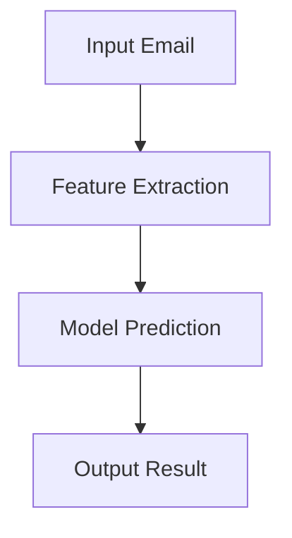

# Email Phishing Detection System

---

## Problem Statement

- Phishing emails are a major cybersecurity threat, tricking users into revealing sensitive information.
- Existing solutions often lack real-time classification capabilities or require extensive manual intervention.
- Need for an automated, accurate, and user-friendly system to detect phishing emails.

---

## Solution Overview

- **System Name**: Email Phishing Detection System
- **Core Features**:
  - Real-time classification of emails as phishing or legitimate.
  - Support for multiple machine learning algorithms (KNN, SVM).
  - Advanced feature engineering (Character N-grams, Heuristics).
  - Analytics dashboard for insights and reporting.
- **Technology Stack**:
  - Backend: FastAPI, SQLAlchemy, scikit-learn
  - Frontend: React, TypeScript

---

## System Architecture

```mermaid
graph TD
    A[User] -->|Classify Email| B[Frontend (React)]
    B -->|API Request| C[Backend (FastAPI)]
    C -->|Feature Extraction| D[ML Models (KNN, SVM)]
    D -->|Prediction| C
    C -->|API Response| B
    B -->|Display Results| A
```

---

## Machine Learning Models

### K-Nearest Neighbors (KNN)
- Custom implementation from scratch.
- Distance metrics: Cosine, Euclidean.
- Weighted and uniform voting.

### Support Vector Machine (SVM)
- Custom implementation from scratch.
- Linear and RBF kernels.
- Confidence scores using decision functions.

---

## Feature Engineering

- **Character N-grams**:
  - Extract sequences of characters (e.g., 3-grams, 5-grams).
  - Captures patterns in phishing emails.
- **Heuristics**:
  - Analyze email headers, URLs, and content.
- **Planned Addition**:
  - Word N-grams for enhanced text analysis.

---

## Results and Performance

### Model Performance

| Model | Accuracy | F1-Score |
|-------|----------|----------|
| SVM   | 97.3%    | 97.1%    |
| KNN   | 92.9%    | 91.8%    |

### Comparison with State-of-the-Art

- Comparable accuracy to commercial solutions.
- Custom models optimized for phishing detection.

---

## Demo Walkthrough

1. **Upload Dataset**:
   - Upload a CSV file of emails for training.
2. **Train Model**:
   - Select features and hyperparameters.
   - Train KNN or SVM model.
3. **Classify Email**:
   - Input email content.
   - Get real-time classification results.
4. **View Analytics**:
   - Dashboard with classification trends and insights.

---

## Code Overview

### High-Level Algorithm



### Key Files

- **Backend**:
  - `app/api/classify.py`: Classification endpoint.
  - `app/ml/features.py`: Feature extraction logic.
  - `app/services/training.py`: Model training pipeline.
- **Frontend**:
  - `phishing-ui/src/components/EmailClassifier.tsx`: Email classification UI.
  - `phishing-ui/src/components/Dashboard.tsx`: Analytics dashboard.

---

## Next Steps

- **Enhancements**:
  - Add word N-grams to feature extraction.
  - Improve model interpretability.
- **Deployment**:
  - Containerize the application using Docker.
  - Deploy to Azure for scalability.
- **Testing**:
  - Conduct extensive user testing.
  - Optimize for large-scale datasets.

---

## Q&A

- Feel free to ask about:
  - System architecture.
  - Machine learning models.
  - Code implementation.
  - Future improvements.

---

## Thank You!

- **Team**: Xolani Kula
- **Contact**: xolani.kula@example.com